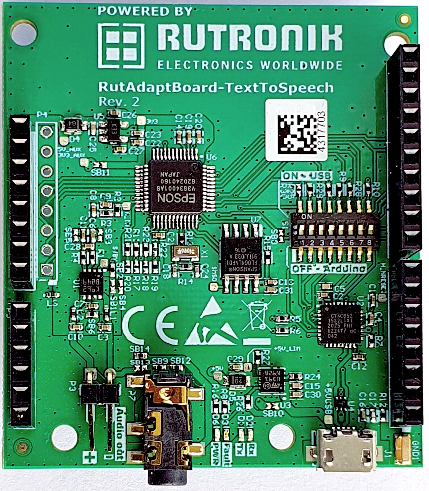
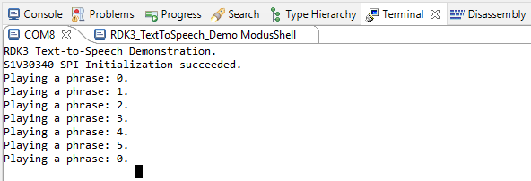
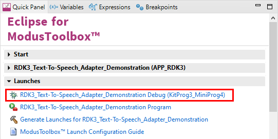

# Text-To-Speech Adapter Code Example

Rutronik Development Kit Programmable System-on-Chip CY8C6245AZI-S3D72 "Text-To-Speech " Code Example. 

This example demonstrates the Rutronik's Text-To-Speech Arduino adapter control.

 

## Requirements

- [ModusToolbox® software](https://www.infineon.com/cms/en/design-support/tools/sdk/modustoolbox-software/) v2.4

### Using the code example with a ModusToolbox IDE:

1. Import the project: **File** > **Import...** > **General** > **Existing Projects into Workspace** > **Next**.
2. Select the directory where **"RDK3_TextToSpeech_Demo"** resides and click  **Finish**.
3. Update libraries using  a **"Library Manager"** tool.
4. Select and build the project **Project ** > **Build Project**.

### Operation

This code example enables developer to play the voice messages [phrases] that are programmed into the Text-To-Speech board's serial flash memory. If the  button "USER BTN1" is pressed - next phrase will be played. The number of the phrase that is being played by the Text-To-Speech adapter will be printed out through the KitProg3 UART on a terminal window.



If you are not using the voice files provided with this code example, please do not forget to modify the key-code provided by Epson in isc_msgs.c file. Please also note that it has to be entered in reverse sequence. For example, the key code **0x1AAA1F85** has to be provided as it is shown below:

```
unsigned char aucIscTestReq[HEADER_LEN + LEN_ISC_TEST_REQ] = {

	0x00, ID_START,

	LEN_ISC_TEST_REQ, 0x00,

	_GET_LOW_BYTE(ID_ISC_TEST_REQ), _GET_HIGH_BYTE(ID_ISC_TEST_REQ),

	0x00, 0x00,				// Check-Sum 1:Enable 0:Disable

	0x01, 0x00,				// 1:Full duplex, 0:Half duplex

	0x85, 0x1F, 0xAA, 0x1A, // key-code
};
```

The audio volume level is hardcoded in this code example. Please modify the isc_msgs.h file to adjust a volume:

`#define	INIT_AUDIO_VOLUME		0x38	// Audio volume (0x00 - 0x43)`

### Debugging

If you successfully have imported the example, the debug configurations are already prepared to use with a the KitProg3, MiniProg4, or J-link. Open the ModusToolbox perspective and find the Quick Panel. Click on the desired debug launch configuration and wait until the programming completes and the debugging starts.



## Legal Disclaimer

The evaluation board including the software is for testing purposes only and, because it has limited functions and limited resilience, is not suitable for permanent use under real conditions. If the evaluation board is nevertheless used under real conditions, this is done at one’s responsibility; any liability of Rutronik is insofar excluded. 


